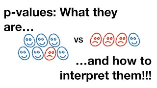

### Articles related to AI
---
 1. [Limitations of current AI **Date:April 6,2020**](https://www.sicara.ai/blog/artificial-general-intelligence)

### Deep learning articles/Videos
 --- 
 1. [Disadvantages of RNN/LSTM **Date:April 20,2020**](https://towardsdatascience.com/the-fall-of-rnn-lstm-2d1594c74ce0)
 2. [Intuition about RNN  **Date:April 23,2020**](https://towardsdatascience.com/illustrated-guide-to-recurrent-neural-networks-79e5eb8049c9)
 
### Python
---
 1. 
 2. [what is the use of if__name__ == "__main__" for ?](http://effbot.org/pyfaq/tutor-what-is-if-name-main-for.htm)

### Stats
---
 1.  

